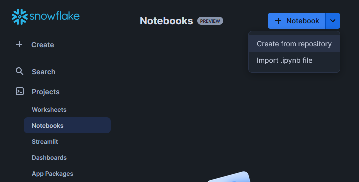
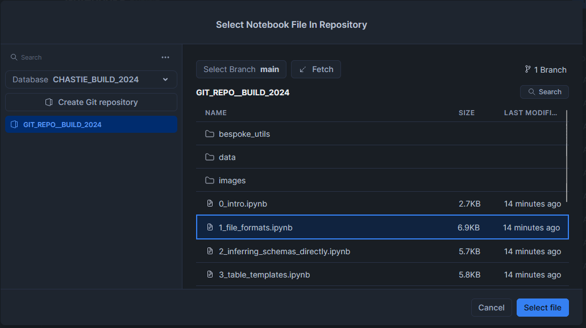

# Schema Evolution for Automated Metadata-Driven Ingestion

Code for Chris Hastie's session for Snowflake BUILD 2024 on how to leverage schema evolution for automated metadata-driven ingestion.

## Leveraging this repository in Snowflake

To leverage this repository, each of the following notebook files can be imported separately into Snowflake:

- 0_intro
- 1_file_formats
- 2_inferring_schemas_directly
- 3_table_templates
- 4_metadata_driven_ingestion
- 5_schema_evolution
- 9_outro

To import any of these notebooks into Snowflake, you must first do the following:

1. Create a database and schema to contain the notebook

    ```sql
    create database if not exists "MY_DATABASE";
    create schema if not exists "MY_DATABASE"."MY_SCHEMA";
    ```

2. Create a warehouse for the notebook to use for queries

    ```sql
    create warehouse if not exists "MY_WAREHOUSE"
      with
        warehouse_size = XSMALL -- Smallest size of warehouse for light workloads
        auto_suspend = 120 -- 2-minute delay before auto-suspend
        initially_suspended = TRUE -- Will not start the warehouse until something attempts to use it
    ;
    ```

3. Create an api integration that points to this repository and grant it to the appropriate role

    ```sql
    create api integration if not exists "API__GIT__INTERWORKS_GITHUB"
      api_provider = GIT_HTTPS_API
      api_allowed_prefixes = ('https://github.com/InterWorks/')
      comment = 'API integration for InterWorks repositories stored in GitHub'
      enabled = TRUE
    ;
    -- RBAC
    grant usage on integration "API__GIT__INTERWORKS_GITHUB" to role "MY_ROLE";
    ```

4. Create the git repository within the database and schema

    ```sql
    create or replace git repository "GIT_REPO__BUILD_2024"
      origin = 'https://github.com/InterWorks/Snowflake-Build-2024---Schema-Evolution.git'
      api_integration = "API__GIT__INTERWORKS_GITHUB"
    ;
    ```

5. Create the notebooks by selecting "Create from repository" in the dropdown for creating new notebooks, then locate the desired notebook from the repository.

    

    

## Sharing this repository

To quickly share this repository, use this QR code:


Alternatively, share this link:

[https://github.com/InterWorks/Snowflake-Build-2024---Schema-Evolution](https://github.com/InterWorks/Snowflake-Build-2024---Schema-Evolution)

## More information on the author

For more information on the author, Chris Hastie, visit his profile at InterWorks and/or LinkedIn.

### InterWorks Profile

[https://interworks.com/people/chris-hastie](https://interworks.com/people/chris-hastie)


### LinkedIn Profile

[https://www.linkedin.com/in/chris-hastie/](https://www.linkedin.com/in/chris-hastie/)


